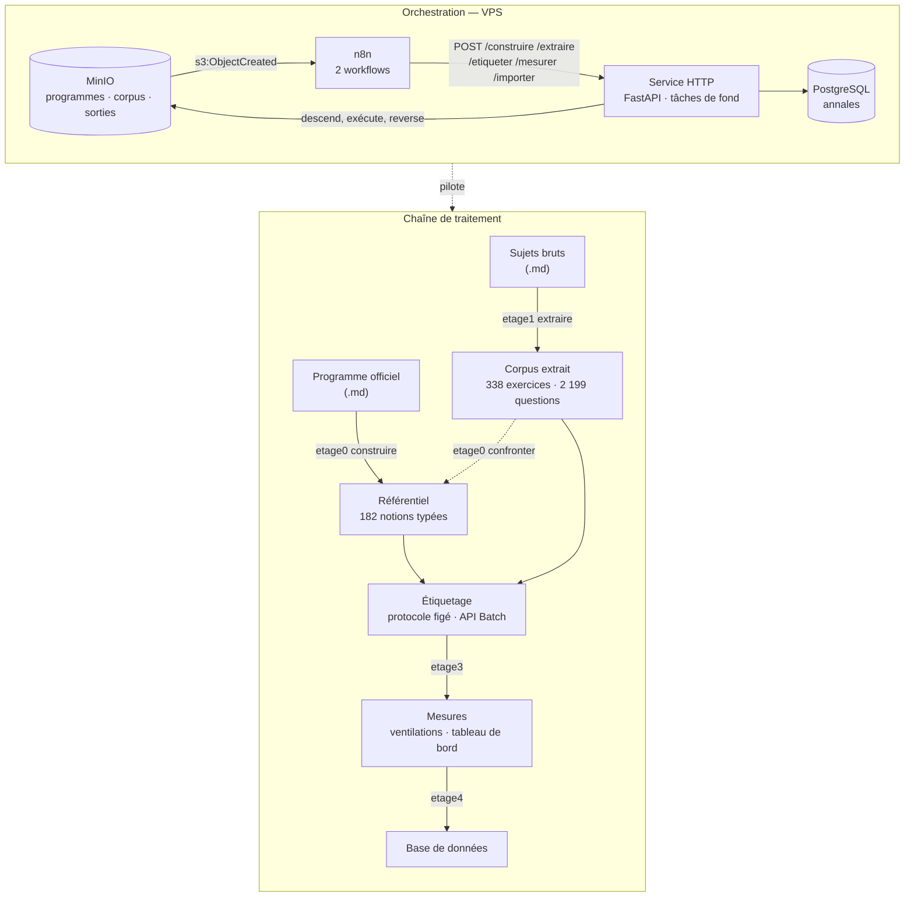

# Analyse d'annales de concours

Pipeline d'alignement d'un corpus d'épreuves sur le programme officiel d'une matière, produisant un ordre de priorité de révision fondé sur la fréquence mesurée des notions.

---

## La chaîne



---

## Installation

```bash
git clone git@github.com:Yanou10/annales.git && cd annales
python -m venv .venv && . .venv/bin/activate      # Windows : .venv\Scripts\activate
pip install '.[service,dev]'
cp .env.example .env                               # y mettre la clé Anthropic
pytest -q                                          # 121 tests
```

Quatre commandes sont installées : `etage0`, `etage1`, `etage3`, `etage4`, plus
`annales-import`.

---


## Structure

| dossier | rôle |
|---|---|
| [`etage0/`](etage0/) | programme officiel → référentiel ; registre de règles à sévérité, renvois typés, confrontation au corpus |
| [`etage1/`](etage1/) | sujets bruts → exercices et questions ; segmentation par titres, déduplication par condensat |
| [`etage3/`](etage3/) | étiquetage contre le référentiel ; protocole vérifié, mode Batch |
| [`etage4/`](etage4/) | ventilations et tableau de bord HTML autonome |
| [`service/`](service/) | API HTTP, import PostgreSQL, image Docker |
| [`n8n/`](n8n/) | les deux workflows d'orchestration |
| [`tests/`](tests/) | 121 tests |

