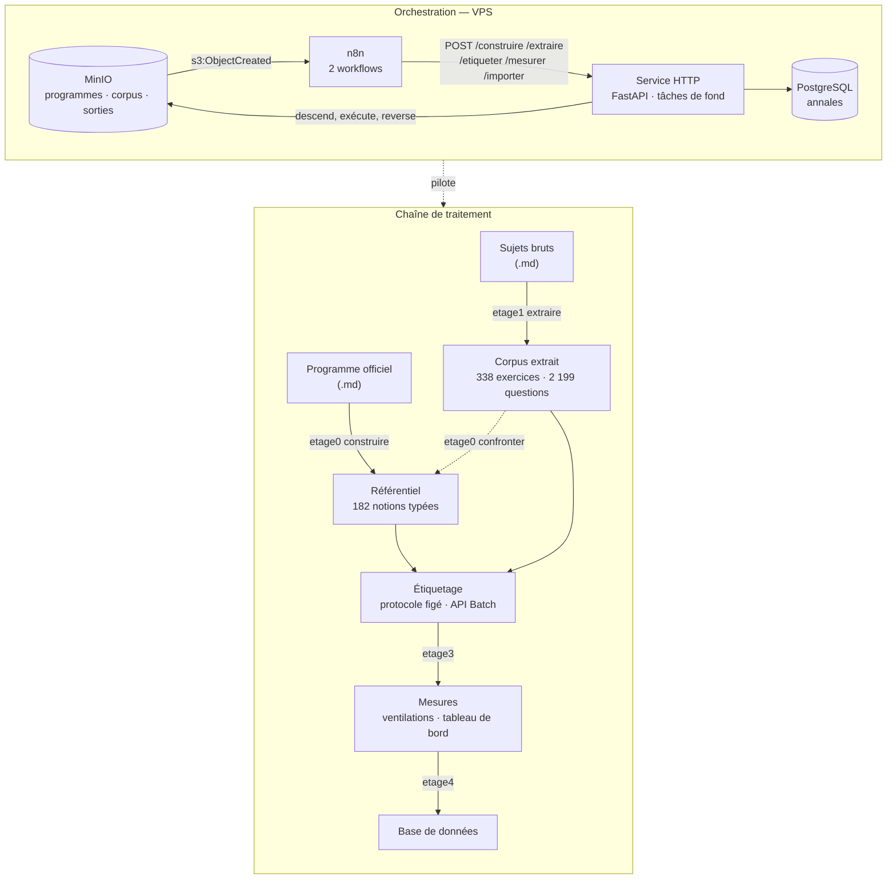

# Annales — référentiel de notions attribuables

Étiqueter les questions de sujets de concours contre un référentiel de notions
construit depuis le programme officiel, pour produire un **ordre de priorité de
révision** : ce qui tombe le plus, ce qui ne tombe jamais, et où le référentiel
lui-même est à sa limite.

Appliqué ici aux annales d'informatique des ENS (MPI et MP option info,
2017–2025). La chaîne ne connaît rien de l'informatique : elle prend un
programme officiel et un corpus, et vaut pour toute matière qui a les deux.

---

## La chaîne



Le trait pointillé de `confronter` vers le référentiel est la boucle de retour :
le corpus révèle des notions que le programme ne nomme pas. Dix des 182 notions
viennent de là, admises seulement si attestées dans **au moins deux fichiers
distincts**.

---

## Installation

```bash
git clone git@github.com:Yanou10/annales.git && cd annales
python -m venv .venv && . .venv/bin/activate      # Windows : .venv\Scripts\activate
pip install '.[service,dev]'
cp .env.example .env                               # y mettre la clé Anthropic
pytest -q                                          # 121 tests
```

Quatre commandes sont installées : `etage0`, `etage1`, `etage3`, `etage4`, plus
`annales-import`.

---

## Séquence, du programme officiel aux mesures

Chaque étape est reprenable : les appels déjà payés sont journalisés dans
`.etage0/journal.jsonl` et rejoués sans nouvel appel.

```bash
# 0. Déposer le programme officiel et les sujets. Ni l'un ni les autres ne sont
#    versionnés : ce sont des entrées, et les sujets de concours ne sont pas à
#    rediffuser. `ETAGE0_PROGRAMME` pointe le fichier déposé.

# 1. Segmentation — déterministe, aucun appel réseau.
#    À relire à l'œil avant de dépenser le premier euro : l'échec de la version
#    précédente du projet était un bug d'étage déterministe qui a contaminé
#    2 011 étiquettes en aval.
etage0 segmenter --detail

# 2. Construction du référentiel — environ 3 $ en appels Opus sur 44 sections.
etage0 construire --etalon referentiel/v1/sections
etage0 renvois                    # contrôle des renvois sur l'ensemble final
etage0 exclusions                 # classe les mentions restrictives du programme

# 3. Extraction du corpus — déterministe, gratuit.
etage1 extraire *.md --sortie corpus/
etage1 verifier corpus/*.json

# 4. Confrontation — cherche dans le corpus ce que le programme ne nomme pas.
#    Déterministe : des sondes versionnées, aucun appel de modèle.
etage0 confronter corpus/*.json --sortie confrontation.json

# 5. Étiquetage — le seul poste coûteux. En Batch : moitié prix.
etage3 etiqueter corpus/*.json --sortie passe-39 --batch --tranche-lot 10

# 6. Mesures.
etage4 tout passe-39/
etage4 dashboard passe-39/ --sortie tableau-de-bord.html
etage4 dispersion passe-39/ passe-39B/     # détecteur de trous, deux passes

# 7. Chargement en base — idempotent.
annales-import --verifier-seulement
annales-import --corpus corpus --referentiel referentiel/genere/sections \
               --etiquettes passe-39 --passe passe-39
```

Le programme officiel, les sujets, le référentiel, le corpus et les passes ne
sont pas versionnés : les deux premiers sont des entrées, les trois autres des
données produites. `referentiel/sondes.yaml`, en revanche, s'écrit à la main —
une sonde est une question posée au corpus, pas une notion.

---

## Déploiement

Le service expose la chaîne en HTTP et n8n l'orchestre. Détails dans
[`service/README.md`](service/README.md) et [`n8n/README.md`](n8n/README.md).

```bash
docker build -f service/Dockerfile -t annales-service .
docker compose -f docker-compose.yml -f service/docker-compose.yml up -d
```

La construction de l'image appelle `--help` sur les cinq commandes : un paquet
incomplet fait échouer le build, pas la production.

Deux workflows n8n, importables tels quels :

| fichier | déclencheur | webhook |
|---|---|---|
| [`n8n/referentiel.json`](n8n/referentiel.json) | dépôt dans `programmes` | `/programme` |
| [`n8n/pipeline.json`](n8n/pipeline.json) | dépôt dans `corpus` | `/traiter` |

### Événements MinIO — deux cibles, et un piège

Une cible `notify_webhook` porte **une seule** URL : router deux buckets vers
deux chemins en demande deux, chacune avec son ARN.

**`mc admin config set` ignore silencieusement `enable=on`.** La cible est créée,
l'endpoint enregistré, et aucun événement ne part — sans message d'erreur.
L'activation doit passer par l'environnement du conteneur MinIO :

```yaml
# docker-compose.yml, service minio
environment:
  MINIO_NOTIFY_WEBHOOK_ENABLE_n8n: "on"
  MINIO_NOTIFY_WEBHOOK_ENDPOINT_n8n: "https://<domaine>/webhook/traiter"
  MINIO_NOTIFY_WEBHOOK_ENABLE_n8n_programme: "on"
  MINIO_NOTIFY_WEBHOOK_ENDPOINT_n8n_programme: "https://<domaine>/webhook/programme"
```

Puis, après redémarrage de MinIO, abonner les buckets :

```bash
mc event add local/corpus     arn:minio:sqs::n8n:webhook           --event put --suffix .md
mc event add local/programmes arn:minio:sqs::n8n_programme:webhook --event put --suffix .md
mc admin info local --json | jq '.info.sqsARN'    # les deux ARN doivent apparaître
```

---

## Méthode

Ce qui fait la valeur du référentiel n'est pas sa taille, c'est ce qu'on a
refusé d'y mettre.

**Le critère d'admission.** Une notion n'entre que si elle répond à : *le
candidat sait quoi réviser ce soir*. « Les graphes » ne le dit pas ; « parcourir
un graphe en largeur » le dit. Sur 44 sections du programme, 83 unités ont été
refusées à ce critère — un tiers de la matière brute.

**Le nommage par l'action.** Chaque notion commence par un verbe à l'infinitif.
Nommer par l'objet (« les arbres binaires ») produit des aimants qui attirent
tout ; nommer par l'action (« implémenter un tableau associatif par ABR ») force
à trancher. Le validateur signale tout libellé qui ne commence pas par un verbe.

**Les exclusions croisées, mécanisme anti-aimant.** Chaque notion déclare ce
qu'elle n'est **pas**, avec un renvoi typé vers la notion voisine — `voir` /
`voir_type` (`notion` ou `section`). Sans elles, une notion large capte les
questions de ses voisines et les fréquences ne mesurent plus rien. Les renvois
sont vérifiés sur l'ensemble final, jamais sur la seule section produite.

**Le protocole figé.** [`config/mesure.yaml`](config/mesure.yaml) déclare le
modèle, la réflexion, l'effort et les bornes. L'étage 3 **refuse de tourner** si
l'environnement s'en écarte, et tout ce que le protocole déclare opérant entre
par construction dans la signature qui indexe le journal. Deux passes de
signatures différentes ne partagent aucun résultat.

---

## Résultats

Corpus de **39 fichiers → 38 documents** (un doublon octet pour octet écarté),
**338 exercices, 2 199 questions**, ratios de conservation du texte de 0,965 à
1,002.

| mesure | valeur |
|---|---|
| étiquettes posées | 2 344 |
| moyenne par question | 1,07 |
| couverture (statut `ok`) | **73,0 % ± 10,7 pt** |
| notions posées | 119 / 182 |
| hors-référentiel | 0,7 % |
| notion la plus fréquente | 14,3 % des questions |
| coût total du projet | ≈ 17 $, soit 0,0042 $ la question |

**La couverture se publie comme intervalle, jamais comme chiffre sec.** Les
± 10,7 points sont mesurés, pas estimés : deux passes strictement identiques sur
le même fichier ont donné 71,9 % et 82,6 %. Ce n'est pas une cible ; son bon
usage est comparatif.

Face à une première version abandonnée — une taxonomie plate de 140 notions :

| | v1 | ici |
|---|---|---|
| questions hors référentiel | 10 % | **0,7 %** |
| notion la plus fréquente | 7,3 % | 14,3 % |

Le second chiffre n'est pas une amélioration : il dit qu'une notion est trop
générale. Voir les limites.

**Coût.** La campagne complète — 672 appels, 6,3 M jetons de prompt — revient à
**9,21 $ en Batch contre 18,43 $ en direct**. Le cache de prompt, lui, s'est
révélé **perdant de 0,99 $** : 75 % du prompt écrit en cache, 4 % relu, parce
que le préfixe n'est constant que par combinaison de sections et que 336
exercices se répartissent en 172 combinaisons.

---

## Limites assumées

**La couverture mesure autant le genre du document que la qualité du
référentiel.** Les recueils d'exercices donnent 1,18 à 1,44 étiquette par
question, les rapports de jury 0,92 à 0,96, les épreuves pratiques 0,71 à 0,81.
Comparer deux fichiers de genres différents ne dit rien du référentiel.

**`bdd` : 11 notions muettes sur 2 199 questions.** La section entière — requêtes
SQL, modélisation entités-associations — n'est jamais interrogée par ce concours.
Le référentiel couvre un pan du programme que le corpus n'aborde pas. C'est une
information de révision, pas un défaut.

**`complexite_algo.evaluer_complexite_algorithme` porte 14,3 % des questions à
elle seule**, et 60 % des occurrences de sa section. La notion est trop générale :
elle absorbe tout ce qui parle de complexité au lieu de distinguer ce qu'on
demande d'en faire. Son éclatement est le premier chantier.

**73 collisions d'identifiants de question**, documentées et non corrigées.
Quatre titres d'exercice se répètent dans leur fichier — `suite-des-questions`
sept fois dans un même sujet. L'étiquetage n'en souffre pas, chaque exercice
partant dans son propre appel ; les mesures désambiguïsent par rang
d'apparition. Le correctif de fond change les identifiants, donc les clés de
journal, donc coûte une repasse complète.

**La conversion PDF → Markdown demande un GPU et se fait hors chaîne.** C'est la
seule étape non reproductible depuis ce dépôt.

**L'instrument n'est reproductible qu'à 52 % au niveau de l'étiquette
individuelle.** Deux passes identiques ne reposent pas les mêmes étiquettes sur
les mêmes questions. Mais les **agrégats sont stables à moins de deux points** —
cumul du top 10 à 1,7 pt, notion la plus fréquente à 0,6 pt, écart médian par
notion 0,6 pt — et c'est à ce niveau que l'instrument est exploité.

Cette instabilité s'est révélée utile : elle se concentre là où le référentiel
est à sa limite. Cinq exercices sur vingt-trois portent 27 des 44 points d'écart.
`etage4 dispersion` les classe — c'est un détecteur de trous, plus fin que le
comptage des questions non couvertes.

---

## Structure

| dossier | rôle |
|---|---|
| [`etage0/`](etage0/) | programme officiel → référentiel ; registre de règles à sévérité, renvois typés, confrontation au corpus |
| [`etage1/`](etage1/) | sujets bruts → exercices et questions ; segmentation par titres, déduplication par condensat |
| [`etage3/`](etage3/) | étiquetage contre le référentiel ; protocole vérifié, mode Batch |
| [`etage4/`](etage4/) | ventilations et tableau de bord HTML autonome |
| [`service/`](service/) | API HTTP, import PostgreSQL, image Docker |
| [`n8n/`](n8n/) | les deux workflows d'orchestration |
| [`tests/`](tests/) | 121 tests |

Chaque défaut corrigé a laissé un test qui le rejoue. Les commentaires du code
disent *pourquoi* une règle existe, avec le cas qui l'a rendue nécessaire — une
section de programme perdue en silence, 30 % du texte non extrait, un plafond de
compilation de grammaires qui n'apparaît qu'en mode Batch.
